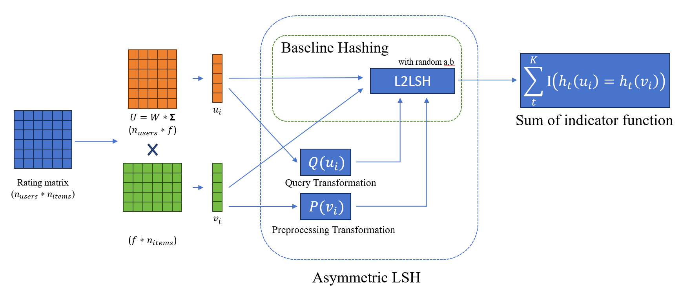
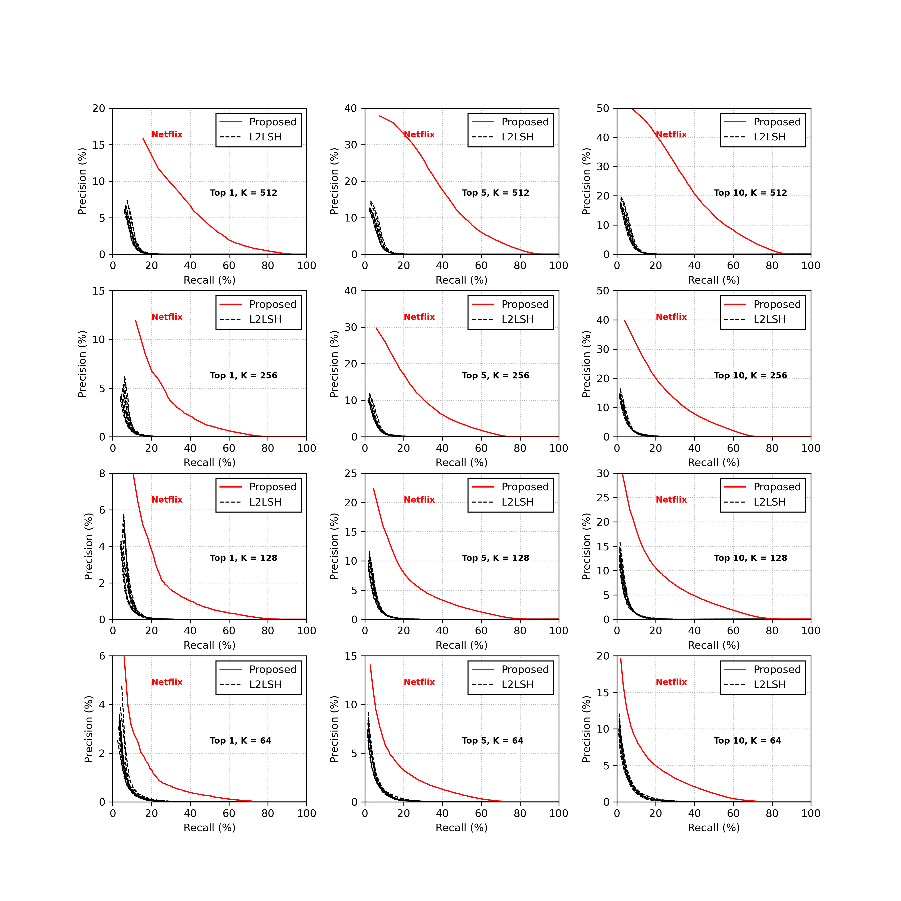
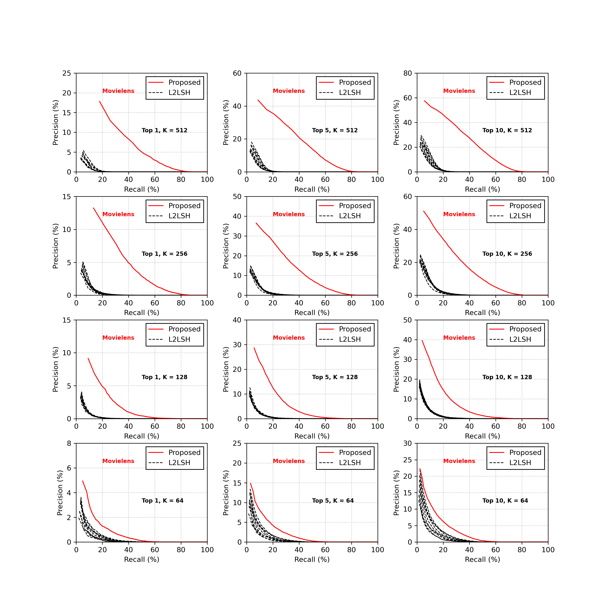
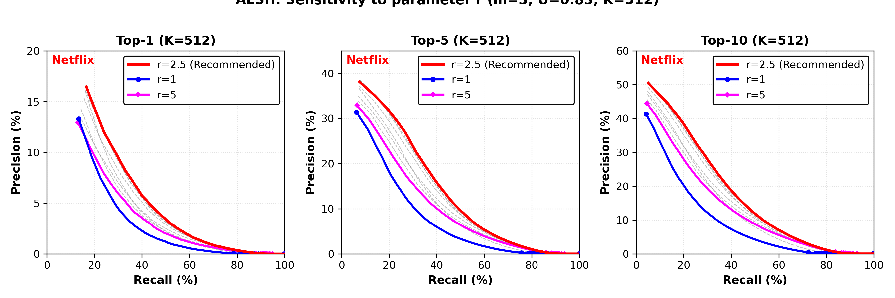

# *Asymmetric LSH (ALSH) for Sublinear Time Maximum Inner Product Search (MIPS)*    (Reproducing  paper from 2012 NIPS)
## Authors
Anshumali Shrivastava, Ping Li
## Abstract
Asymmetric LSH is the first provably sublinear time algorithm for approximate Maximum Inner Product Search. By applying asymmetric transformations to the query vector q and item vector p, the MIPS problem can be transformed into a nearest neighbor search problem under Euclidean distance(L2 distance).

## Environment
You will need the following packages to run the code:
- python==3.11.13
- numpy==2.0.1
- pandas==2.1.3
- scipy==1.16.0
- matplotlib==3.10.0
- tqdm==4.67.3
## Dataset
- **Movielens 10M dataset** 
- **Netflix Prize dataset**
## Usage
### Data preparation
Downloading the dataset above, add the file **ratings.dat** from **Movielens** to **./movielens_data** and the combined_data list from **Netflix** to **./netflix_data**. Then run the command below,
```
python data_pre.py
```
### Quick run
You can run the command below directly to get the experiment result of Netflix Prize Dataset.
```
python main.py
```
### Experiment
You can change the parameter given below
- db: It will show on the result picture.
- input: The sparse matrix file name
- f_param: Latent dimension when doing PureSVD procedure.
- U_param: The upper bound set for the L2-norm of items. (U need smaller than 1).
- padding: The dimension added for vectors when doing asymmetric transformation.
- num_users: The number of users (or queries) chosen to run the experiment.
- num_r_runs: The number of times we run alsh experiment to choose best r.

Example command
```
python main.py --db Movielens --input movielens_matrix.npz --f_param 150 --U_param 0.83 --padding 3 --num_users 2000 --num_r_runs 5
```
### Result
We fully reproduced the experiment results of the chosen paper. The results are shown below.



